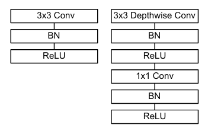
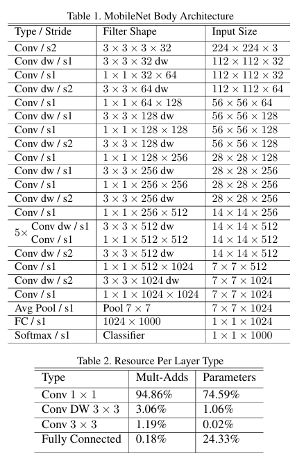

# MobileNetV1 - CIFAR-10

Bu repo, [MobileNets: Efficient Convolutional Neural Networks for Mobile Vision Applications](https://arxiv.org/abs/1704.04861) makalesinde tanımlanan **MobileNetV1** mimarisinin PyTorch ile sıfırdan implementasyonunu ve CIFAR-10 veri seti üzerinde eğitilmesini içerir.

## Mimari

MobileNetV1'in temel yapı taşı, standart konvolüsyonu iki ayrı katmana bölen **depthwise separable convolution** bloğudur. Bu sayede parametre sayısı ve işlem maliyeti klasik CNN'lere göre ciddi oranda azalır.

<p align="center">
  
</p>

*Solda standart konvolüsyon bloğu, sağda MobileNet'in kullandığı depthwise separable blok görülüyor.*

Bu bloklar art arda dizilerek makaledeki gövde mimarisi elde edilir:

<p align="center">
  
</p>

Bu projede giriş boyutu makaledeki gibi 224x224 alınmış, CIFAR-10 görüntüleri (32x32) bu boyuta yeniden ölçeklenmiştir. Sınıflandırıcı katmanı 1000 yerine 10 sınıfa göre uyarlanmıştır.

## Kullanılan Veri Seti

- **CIFAR-10**: 10 sınıf, 50.000 eğitim + 10.000 test görüntüsü
- Eğitim setine `RandomHorizontalFlip` ve `RandomCrop` (padding=4) augmentasyonları uygulanmıştır
- Görüntüler 224x224 boyutuna yeniden ölçeklenip normalize edilmiştir

## Eğitim Detayları

| Parametre | Değer |
|---|---|
| Optimizer | Adam |
| Learning Rate | 1e-3 |
| Loss Function | CrossEntropyLoss |
| Batch Size | 32 |
| Epoch | 20 |

### Sonuçlar

20 epoch sonunda elde edilen sonuçlar:

| Metrik | Değer |
|---|---|
| Train Accuracy | ~94.6% |
| Test Accuracy | ~90.4% |
| Train Loss | 0.1530 |
| Test Loss | 0.3338 |

## Kullanım

Notebook'u sırasıyla çalıştırarak:

1. CIFAR-10 veri seti otomatik indirilir
2. `MobileNetV1` modeli oluşturulur
3. Model 20 epoch boyunca eğitilir
4. Ağırlıklar `.pth` dosyası olarak kaydedilir
5. Kendi görsellerinizle tahmin (inference) yapılabilir

```python
model = MobileNetV1(num_classes=10)
```

## Referans

- Howard, A. G. et al. (2017). *MobileNets: Efficient Convolutional Neural Networks for Mobile Vision Applications*. [arXiv:1704.04861](https://arxiv.org/abs/1704.04861)
